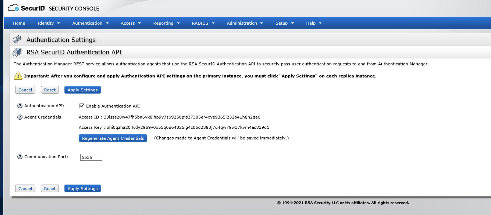
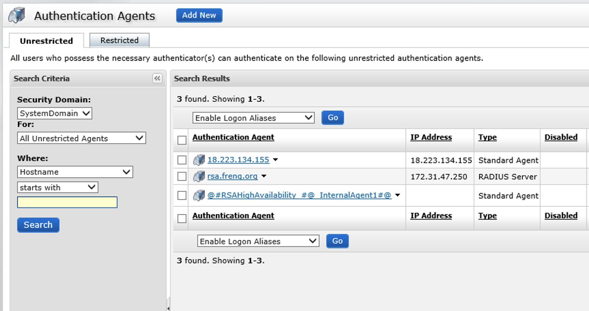
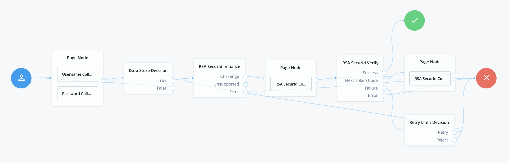

<!--
 * The contents of this file are subject to the terms of the Common Development and
 * Distribution License (the License). You may not use this file except in compliance with the
 * License.
 *
 * You can obtain a copy of the License at legal/CDDLv1.0.txt. See the License for the
 * specific language governing permission and limitations under the License.
 *
 * When distributing Covered Software, include this CDDL Header Notice in each file and include
 * the License file at legal/CDDLv1.0.txt. If applicable, add the following below the CDDL
 * Header, with the fields enclosed by brackets [] replaced by your own identifying
 * information: "Portions copyright [year] [name of copyright owner]".
 *
 * Copyright 2019 ForgeRock AS.
-->
# RSA SecurID Authentication Nodes

The **RSA SecurID** authentication nodes lets administrators integrate RSA SecurID Access Management MFA into 
an ForgeRock AM authentication trees.

## Usage

To deploy these nodes, download the jar from the releases tab on github
[here](https://github.com/ForgeRock/Rsa-SecurId-Auth-Tree-Nodes/releases/latest). Next, copy the jar into the
../web-container/webapps/openam/WEB-INF/lib directory where AM is deployed. Restart the web container to pick up the
new nodes. The nodes will then appear in the authentication trees components palette.

### Import Tree
Use the [AM Tree Tool](https://github.com/vscheuber/AM-treetool) to import the RSA tree:
```
./amtree.sh -h https://cdk.iam.example.com/am -u amadmin -p 'password' -i -t RsaTree -f rsa.json
```

### RSA SecurID Initialize Node
This node initializes the MFA request to RSA SecurID based on the username collected.

#### RSA SecurID Initialize Node Configuration
* **Base URL** - The base URL of the RSA SecurID AM instance
* **Client ID** - The client ID of the agent configured in RSA SecurID
* **Client Key** - The RSA SecurID Authentication API Client Key.
* **Verify SSL** - If SSL validation is required for the client, set this parameter to "true". If SSL validation is not required, set the parameter as "false".

### RSA SecurId Collector Node
This node collects the one time password for use with RSA SecurID.  It supports both SECURID as well as
SECURID_NEXT_TOKENCODE challenges.


### RSA SecurId Verify Node
This node sends the collected one time password to RSA SecurID for validation. It supports both SECURID as well as 
SECURID_NEXT_TOKENCODE challenges.

#### RSA SecurId Verify Node Configuration

* **Base URL** - Enable the RSA SecurID
* **Client Key** - The RSA SecurID Authentication API Client Key.
* **Verify SSL** - If SSL validation is required for the client, set this parameter to "true". If SSL validation is not required, set the parameter as "false".


### RSA SecurId Configuration
1. Follow instructions [here](https://community.rsa.com/t5/securid-authentication-manager/configure-the-rsa-securid-authentication-api-for-authentication/ta-p/568410)
to enable the RSA SecurID Authentication API. Note the Access Key for use when configuring the tree.
   
2. Follow instructions [here](https://community.rsa.com/t5/securid-authentication-manager/add-an-authentication-agent/ta-p/629323)
to create an Authentication Agent. Note the Agent Name for use when configuring the tree.
   


### Example Flow


